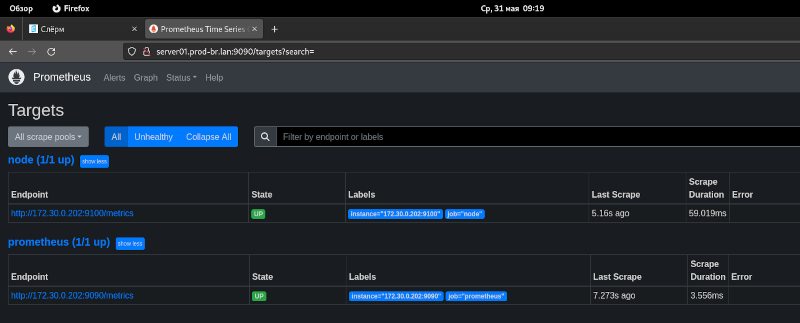
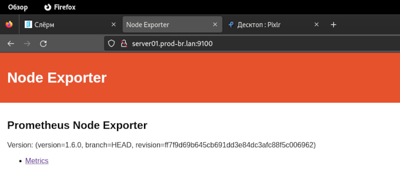
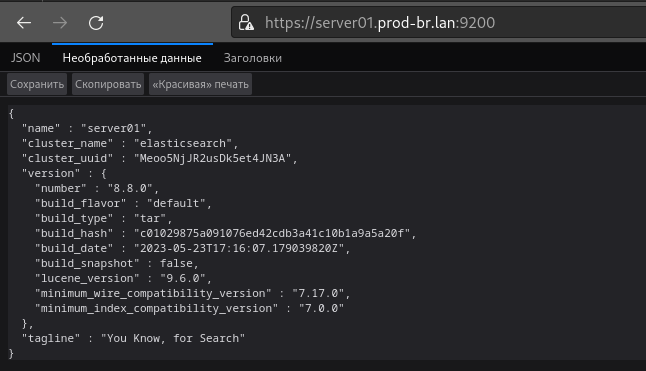

# Ansible playbook with roles to install Monitoring and Logging software

A set of Ansible roles to install and configure Prometheus and its exporters, as well as the EFK logging stack.

## Prometheus

- Creates the right user, group and directories with the right permissions and owners
- Installs Prometheus Server as a service
- Adds Configuration with a preset target for monitoring Prometheus itself (see <https://prometheus.io/docs/prometheus/latest/getting_started/#configuring-prometheus-to-monitor-itself>)
- Adds Systemd service file to run it
- Starts and restarts the service when the global configuration parameters are changed
  
**Note** The list of versions is available on the [github](https://github.com/prometheus/prometheus/releases) page



## Node Exporter
  
- Creates the right users and directories with the right permissions and owners
- Installs the Node Exporter
- Adds
  - Systemd service file to run it
  - A new host to the Prometheus configuration through <https://prometheus.io/docs/prometheus/latest/configuration/configuration/#static_config> (don't forget that the server with Prometheus may not be located locally, you need to be able to add the configuration to a remote server as well).
  - Runs the Node Exporter service and reloads the Prometheus service when adding a new host to the configuration
  
**Note**: The list of versions is available on the [github](https://github.com/prometheus/node_exporter/releases) page
  
Bear in mind that you shouldn't have any configuration conflicts when running the Node Exporter role and the Prometheus role, even though both roles make changes to the config.



## EFK (Elasticsearch + Kibana)

- Creates the right users and directories with the right permissions and owners
- Installs the Elasticsearch and Kibana
- Add systemd service file to run it
- Runs the Elasticsearch and Kibana services



Use the following command to retrieve the password for http.p12:

```bash
root@server01:~# /srv/elasticsearch/bin/elasticsearch-keystore show xpack.security.http.ssl.keystore.secure_password
fpn8ZrRARj2piuW1h9o9WA
```

Use the following command to retrieve the password for transport.p12:

```bash
root@server01:~# /srv/elasticsearch/bin/elasticsearch-keystore show xpack.security.transport.ssl.keystore.secure_password
GEop6AsVTKKa8SPFEp3ZSA
```

You can complete the following actions at any time:
Reset the password of the elastic built-in superuser with

```bash
root@server01:~# /srv/elasticsearch/bin/elasticsearch-reset-password -u elastic                                          
This tool will reset the password of the [elastic] user to an autogenerated value.
The password will be printed in the console.

Please confirm that you would like to continue [y/N]y

Password for the [elastic] user successfully reset.
New value: pDI3it5r*Gd8yn*wvE7F
```

Generate an enrollment token for Kibana instances with

```bash
root@server01:~# /srv/elasticsearch/bin/elasticsearch-create-enrollment-token -s kibana
```

Generate an enrollment token for Elasticsearch nodes with

```bash
root@server01:~# /srv/elasticsearch/bin/elasticsearch-create-enrollment-token -s node
```

## FluentBit

- Creates the right users and directories with the right permissions and owners
- Installs FluentBit
- Add systemd service file to run it
- Runs the FluentBit

----

## Requiremetns

### 1. Generate SSH key and copy to role files folder

**Note**
The key files present in the project are provided for introductory purposes. It is highly recommended to create personal keys on your own.

In a terminal window run the following commads:

```bash
cd ~
git pull https://github.com/idevappspro/monlog.git
cd ~/monlog/roles/provision_ssh_key
ssh-keygen -t rsa ssh-keygen -f ./ssh_auth
```

Follow the prompts to generate the key. A public and a private key are generated. The public key has .pub in the file name.

```bash
eval "$(ssh-agent -s)"
ssh-add ./ssh_auth
cd ~/monlog
```

### 2. Inventory

Define proper host and its IP address into the inventory file

```inventory.yaml```

----

## Run playbook

Execute the following command in you terminal from the machine with access to target hosts

```bash
ansible-playbook playbook.yaml
```

----

## Project file structure

```text
── ansible.cfg
├── images
│   ├── node.png
│   └── prom.png
├── inventory.yaml
├── playbook.yaml
├── README.md
├── requirements.yaml
└── roles
    ├── efk
    │   ├── defaults
    │   │   └── main.yml
    │   ├── files
    │   ├── handlers
    │   │   └── main.yml
    │   ├── meta
    │   │   └── main.yml
    │   ├── README.md
    │   ├── tasks
    │   │   └── main.yml
    │   ├── templates
    │   ├── tests
    │   │   ├── inventory
    │   │   └── test.yml
    │   └── vars
    │       └── main.yml
    ├── node_exporter
    │   ├── defaults
    │   │   └── main.yml
    │   ├── files
    │   │   └── node_exporter.service
    │   ├── handlers
    │   │   └── main.yml
    │   ├── meta
    │   │   └── main.yml
    │   ├── README.md
    │   ├── tasks
    │   │   └── main.yml
    │   ├── templates
    │   ├── tests
    │   │   ├── inventory
    │   │   └── test.yml
    │   └── vars
    │       └── main.yml
    ├── prometheus
    │   ├── defaults
    │   │   └── main.yml
    │   ├── files
    │   │   └── prometheus.service
    │   ├── handlers
    │   │   └── main.yml
    │   ├── meta
    │   │   └── main.yml
    │   ├── README.md
    │   ├── tasks
    │   │   └── main.yml
    │   ├── templates
    │   ├── tests
    │   │   ├── inventory
    │   │   └── test.yml
    │   └── vars
    │       └── main.yml
    └── provision_ssh_key
        ├── defaults
        │   └── main.yml
        ├── files
        │   ├── ssh_auth
        │   └── ssh_auth.pub
        ├── handlers
        │   └── main.yml
        ├── meta
        │   └── main.yml
        ├── README.md
        ├── tasks
        │   └── main.yml
        ├── templates
        ├── tests
        │   ├── inventory
        │   └── test.yml
        └── vars
            └── main.yml
```
